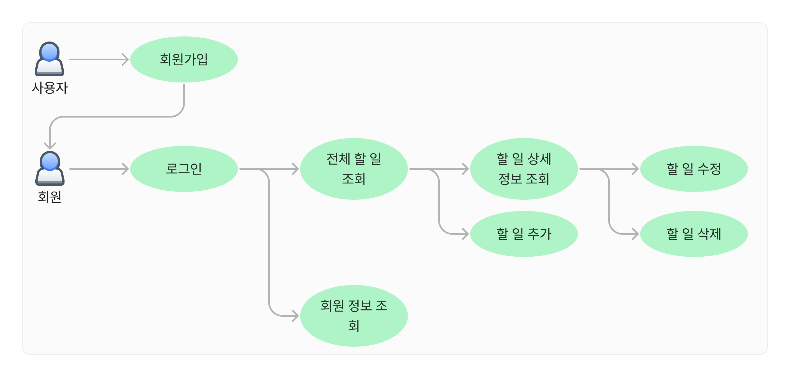

# 자바 웹 프로젝트 - Todolist

노션: https://www.notion.so/Todolist-7d87685f24d64574baf7ab9ad69a6cbe?pvs=21

깃허브: https://github.com/namsu-k/todo-backend

# 개요

## 소개

할 일 관리 (To-do list) 웹 어플리케이션

## 기획 의도 및 목표

본 프로젝트는 학습한 기술들을 실전적으로 적용해보기 위해 시작되었습니다. 프로젝트 기간이 제한적이어서 기능은 최소한으로 설정하고, 간단한 할 일 목록 웹 어플리케이션을 개발하는 것을 목표로 하였습니다.

## 진행 기간

2023년 7월 25일 ~ 2023년 8월 27일 (약 1개월)

# 주요 기능 및 화면

## 유즈케이스 다이어그램

## ER 다이어그램

## API 명세서

## 기술 스택

### Frontend

- React
- react-router-dom
- tanstack query
- react-hook-form
- chakra-ui
- Axios

### Backend

- Java
- Spring boot
- Gradle
- H2 database
- JPA
- Postman
- Spring Security
- JWT

## 기능 소개

### 로그인 및 회원가입

- 회원가입 시 Json Web Token 발급 및 Token 인증을 통해 로그인

### 할 일 추가 및 할 일 목록 조회

- 로그인 시 회원이 작성한 할 일 목록을 표시 및 입력 창을 통한 할 일 추가 기능

### 할 일 상세 조회 및 삭제

- 할 일의 상세 정보 (마감기한, 추가 설명, 완료 여부 등) 표시 및 삭제 기능

### 내 정보 조회

- 현재 로그인된 회원의 상세 정보 표시 기능

## 기능 상세

[기능 상세](README-todo/%E1%84%80%E1%85%B5%E1%84%82%E1%85%B3%E1%86%BC%20%E1%84%89%E1%85%A1%E1%86%BC%E1%84%89%E1%85%A6%20d0206aed68af45bc9d84d2ff9c6a08dc.csv)

## 자체 평가 및 의견

### 기획 및 설계

- 기획
    
    프로젝트를 진행하면서 기획이라는 것의 필요성을 제대로 느꼈습니다. 개인적으로 나침반없이 항해를 하는 것과 같았습니다. 완벽하지 않더라도 기획을 한 후 개발 단계로 들어갔어야 했다는 것을 깨달았습니다. 전공 관련 지식을 좀 더 학습하여 기획하는 능력을 키워야겠다고 생각했습니다.
    
- 설계
    
    소프트웨어 설계에 대한 지식이 많이 부족하다는 것을 느꼈습니다. 또한 전반적인 개발 프로세스에 대한 부족함도 많이 느꼈습니다. 개발 도중 막히는 부분에 대해서 해결할 수 있는 자원을 떠올리지 못 하여 정보를 찾는 시간이 더 많았습니다. 앞으로 여러 기술들을 꾸준히 접해보고 설계를 지속적으로 학습할 예정입니다.
    

### 문서화 및 협업

- 문서화
    
    개발에 필요한 여러 문서가 있지만 그 중에서도 가장 필요성을 느낀 것은 API 문서였습니다. 백엔드와 프론트엔드간 원활한 소통이 이루어질 수 있도록 API 문서에 비중을 두지 않은 것이 아쉬웠습니다. 최신 버전의 스프링 프레임워크에서 swagger ui가 잘 동작하지 않았던 문제를 해결하지 못한 것도 아쉬웠습니다.
    
- 협업
    
    협업을 조금이라도 경험하고 싶어서 github를 활용해보려고 했습니다. 그러나 버전 관리 및 기능 활용에 대한 부분의 지식이 미흡하여 원격 저장소를 만들고 커밋과 푸시만 활용하게 되었습니다. 기능이나 버전별 브랜치를 생성하여 개발하려고 했지만 활용 능력의 부족함으로 그러지 못하였습니다. github의 기능 및 활용 방법에 대해서 정확히 공부하고 숙달하여 원활한 협업을 할 수 있도록 하겠습니다.
    

### 테스트

- 테스트
    
    무엇보다 개발을 해보면서 가장 불편했던 점은 직접 서버를 실행하고 데이터베이스에 데이터를 추가하고 확인하는 일련의 과정이 굉장히 불편하다는 것을 느꼈습니다. 또한 테스트를 이렇게 빈번하게 할 줄 몰랐습니다. 앞으로는 테스트 코드를 작성하여 개발된 메소드나 기능을 시험해보는 습관을 꼭 들이도록 할 것입니다.
